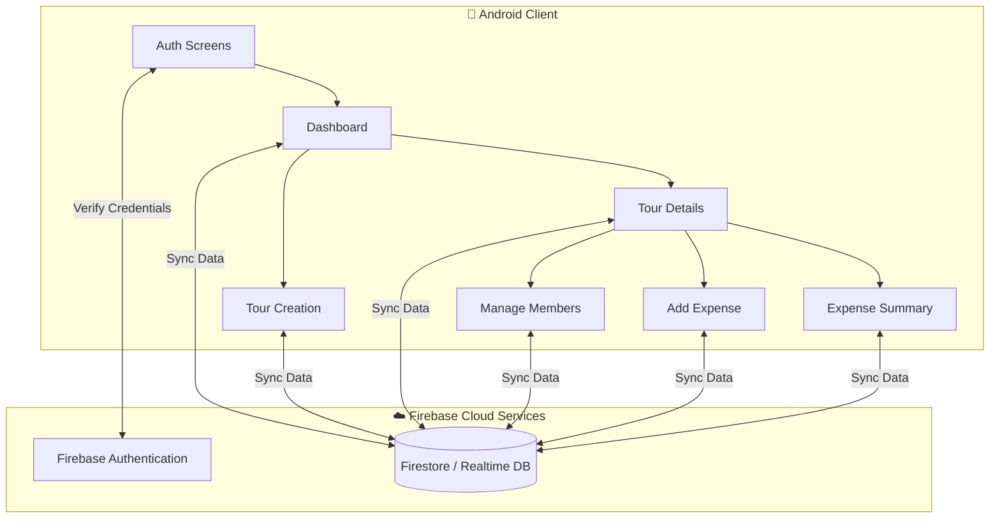

<div align="center">

# 🌍 TourSplitter

### _The Ultimate Travel Expense Sharing & Management App_

[](https://developer.android.com/)
[](https://www.java.com/)
[](https://kotlinlang.org/)
[](https://firebase.google.com/)

<br/>

```
    ╔══════════════════════════════════════════════════════╗
    ║                                                      ║
    ║        ✈️  🚗  🏕️  🗺️  💸  🤝  📊  📱                 ║
    ║                                                      ║
    ║        ████████╗ ██████╗ ██╗   ██╗██████╗            ║
    ║        ╚══██╔══╝██╔═══██╗██║   ██║██╔══██╗           ║
    ║           ██║   ██║   ██║██║   ██║██████╔╝           ║
    ║           ██║   ██║   ██║██║   ██║██╔══██╗           ║
    ║           ██║   ╚██████╔╝╚██████╔╝██║  ██║           ║
    ║           ╚═╝    ╚═════╝  ╚═════╝ ╚═╝  ╚═╝           ║
    ║                                                      ║
    ║      Split costs, not friendships. Travel smart.     ║
    ╚══════════════════════════════════════════════════════╝
```

<br/>

> ⛺ A **native Android application** designed to take the headache out of group travel. Create tours, add your friends, log group expenses, and instantly calculate "who owes who"—all backed by the real-time cloud syncing power of **Firebase**.

---

[Features](#-features) •
[App Screens](#-app-workflow) •
[Tech Stack](#-tech-stack) •
[Architecture](#-architecture) •
[Setup](#-quick-start)

</div>

---

## ✨ Features

<table>
<tr>
<td width="50%">

### 🔐 Secure Authentication
- **User Registration & Login:** Create a personalized account.
- **Firebase Auth Integration:** Secure, cloud-based credential management.
- **Persistent Sessions:** Stay logged in across app launches.

### 🗺️ Tour Management
- **Create Tours:** Start a new trip with a name, destination, and dates.
- **Manage Members:** Invite and add friends to specific tours.
- **Dashboard Overview:** View all your active and past tours in one place.

</td>
<td width="50%">

### 💸 Expense Splitting
- **Log Expenses:** Record who paid for what (e.g., fuel, hotel, food).
- **Categorize Costs:** Keep your travel spending organized.
- **Add Expense Interface:** Quick and intuitive data entry on the go.

### 📊 Real-Time Summaries
- **Expense Summaries:** Instantly calculate total trip costs.
- **Debt Resolution:** Automatically figure out who owes money to whom.
- **Cloud Sync:** Everyone in the group sees updates in real-time.

</td>
</tr>
</table>

---

## 📱 App Workflow

The application is structured into a clean, intuitive flow consisting of several dedicated Activities:

1. **`LoginActivity` / `RegisterActivity`**: Secure entry portals for users.
2. **`DashboardActivity`**: The central hub displaying all created and joined tours.
3. **`CreateTourActivity`**: Form to initialize a new group trip.
4. **`ManageMembersActivity`**: Interface to add or remove participants from a tour.
5. **`TourDetailsActivity`**: A deep dive into a specific trip's overall status.
6. **`AddExpenseActivity`**: The logging mechanism for when someone makes a group purchase.
7. **`ExpenseSummaryActivity`**: The automated calculator showing balances and settlements.

---

## 🛠️ Tech Stack

<div align="center">

| Layer | Technology | Purpose |
|:---|:---|:---|
| **Platform** | Android SDK (Target 36) | Native mobile development |
| **Languages** | Java & Kotlin | Core application logic and UI bindings |
| **Backend / DB** | Firebase (Google Services) | Cloud database and user authentication |
| **Build System** | Gradle (Kotlin DSL) | Dependency management and build configuration |
| **UI Framework** | XML / Android Views | Structuring the graphical user interface |

</div>

---

## 🏗️ Architecture



---

## 🚀 Quick Start

### Prerequisites

| Requirement | Why |
|:---|:---|
| **Android Studio** | The official IDE for Android development |
| **Java JDK 17+** | Required by modern Gradle builds |
| **Firebase Account** | To configure the backend services |

### Installation

**1. Clone the repository**
```bash
git clone https://github.com/hussnainahmedd/TourSplitter.git
```

**2. Open in Android Studio**
- Launch Android Studio.
- Click `Open` and select the cloned `TourSplitter` directory.
- Allow Gradle to sync and download necessary dependencies.

**3. Configure Firebase**
> [!WARNING]  
> Because this app relies on Firebase, you must provide your own `google-services.json` file.
1. Go to the [Firebase Console](https://console.firebase.google.com/).
2. Create a new project.
3. Add an Android app with the package name: `com.example.toursplitter`.
4. Download the `google-services.json` file.
5. Place the file inside the `app/` directory of this project.
6. Enable **Authentication** (Email/Password) and your preferred **Database** (Firestore/Realtime DB) in the Firebase console.

**4. Build and Run**
- Connect an Android device or start the Android Emulator.
- Click the green **Run** (▶️) button in Android Studio.

---

## 🤝 Contributing

1. **Fork** the repository
2. **Create** a feature branch (`git checkout -b feature/amazing-feature`)
3. **Commit** your changes (`git commit -m '✨ Add amazing feature'`)
4. **Push** to the branch (`git push origin feature/amazing-feature`)
5. **Open** a Pull Request

---

<div align="center">

**⭐ Star this repo if you love traveling without the math!**

<br/>

Built with ☕ Java, Kotlin, and Firebase.

</div>
